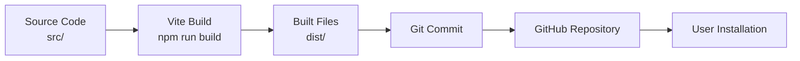

# Package Architecture & Distribution

## 📦 Package Structure

```
divt-text-editor/
├── src/                          # Source code (not distributed)
│   ├── components/
│   │   ├── DivtTextEditor/
│   │   │   ├── DivtTextEditor.jsx
│   │   │   ├── extensions/
│   │   │   └── styles.css
│   │   └── EditorDialog/
│   └── index.js
│
├── dist/                         # Built files (MUST be committed!)
│   ├── divt-text-editor.es.js   # ES module build
│   ├── divt-text-editor.umd.js  # UMD build
│   └── divt-text-editor.css     # Compiled styles
│
├── public/                       # Development assets
├── node_modules/                 # Dependencies
├── package.json                  # Package configuration
├── .gitignore                    # Git ignore rules
├── .npmignore                    # npm ignore rules
└── index.d.ts                    # TypeScript definitions
```

---

## 🔄 Build Process



### Build Command

```bash
npm run build
```

This runs Vite to:
1. Bundle React components
2. Compile JSX to JavaScript
3. Process CSS
4. Generate ES and UMD modules
5. Output to `dist/` folder

---

## 📤 Distribution Methods

### Method 1: GitHub Installation (Current)

```bash
npm install github:votuandi/divt-text-editor#v0.1.2
```

**Flow:**
```
User runs npm install
    ↓
npm clones GitHub repository
    ↓
Git transfers committed files only
    ↓
dist/ folder included (if committed)
    ↓
package.json points to dist/divt-text-editor.es.js
    ↓
Import works! ✅
```

**Requirements:**
- ✅ `dist/` must be committed to Git
- ✅ `dist/` must NOT be in `.gitignore`
- ✅ Build must run before committing

**The Problem We Fixed:**
```diff
# .gitignore
- dist/          ❌ This prevented dist/ from being committed
+ # dist/ must be committed for GitHub installations
```

---

### Method 2: npm Registry (Future Option)

```bash
npm publish
npm install divt-text-editor
```

**Flow:**
```
Maintainer runs npm publish
    ↓
npm reads .npmignore (not .gitignore)
    ↓
npm packages files listed in package.json "files"
    ↓
npm uploads to registry
    ↓
User runs npm install
    ↓
npm downloads pre-built package
    ↓
Import works! ✅
```

**Advantages:**
- ✅ Standard workflow
- ✅ `dist/` doesn't need to be in Git
- ✅ Better version management
- ✅ Faster installation

---

## 🎯 Package Entry Points

### package.json Configuration

```json
{
  "main": "./dist/divt-text-editor.umd.js",
  "module": "./dist/divt-text-editor.es.js",
  "types": "./index.d.ts",
  "exports": {
    ".": {
      "types": "./index.d.ts",
      "import": "./dist/divt-text-editor.es.js",
      "require": "./dist/divt-text-editor.umd.js"
    },
    "./style.css": "./dist/style.css"
  },
  "files": [
    "dist",
    "index.d.ts"
  ]
}
```

### What This Means

1. **`main`**: Default entry point (CommonJS/UMD)
2. **`module`**: ES module entry point (modern bundlers)
3. **`types`**: TypeScript definitions
4. **`exports`**: Modern export map (Node.js 12+)
5. **`files`**: What gets included in npm package

### Import Resolution

When a user imports:
```javascript
import { DivtTextEditor } from 'divt-text-editor';
```

The bundler looks for:
1. `exports["."].import` → `./dist/divt-text-editor.es.js` ✅
2. Falls back to `module` → `./dist/divt-text-editor.es.js` ✅
3. Falls back to `main` → `./dist/divt-text-editor.umd.js` ✅

**All paths point to `dist/`** - that's why it must exist!

---

## 🚫 Ignore Files Explained

### .gitignore (Git)

Controls what Git tracks:

```gitignore
node_modules     # Never commit dependencies
# dist           # REMOVED - must commit for GitHub installs
dist-ssr         # SSR build artifacts
*.local          # Local config files
```

**Purpose**: Keep repository clean, but include distribution files.

### .npmignore (npm)

Controls what npm publishes:

```npmignore
src/             # Don't publish source code
.storybook/      # Don't publish dev tools
*.md             # Don't publish docs (except README)
!README.md       # But DO publish README
```

**Purpose**: Keep npm package small, only include necessary files.

**Note**: If `.npmignore` exists, npm ignores `.gitignore`!

---

## 🔀 Installation Flow Comparison

### GitHub Installation (Before Fix)

```
npm install github:user/repo
    ↓
Git clones repository
    ↓
.gitignore excludes dist/
    ↓
❌ dist/ folder missing
    ↓
package.json points to dist/divt-text-editor.es.js
    ↓
❌ Module not found error!
```

### GitHub Installation (After Fix)

```
npm install github:user/repo
    ↓
Git clones repository
    ↓
dist/ is committed (not ignored)
    ↓
✅ dist/ folder included
    ↓
package.json points to dist/divt-text-editor.es.js
    ↓
✅ Import works!
```

### npm Registry Installation

```
npm install package-name
    ↓
npm downloads from registry
    ↓
.npmignore controls what's included
    ↓
✅ dist/ folder included (in "files")
    ↓
package.json points to dist/divt-text-editor.es.js
    ↓
✅ Import works!
```

---

## 🛠️ Development Workflow

### For Maintainers

```bash
# 1. Make changes to source code
vim src/components/DivtTextEditor/DivtTextEditor.jsx

# 2. Test locally
npm run dev

# 3. Build for distribution
npm run build

# 4. Commit BOTH source and built files
git add src/ dist/
git commit -m "feat: add new feature"

# 5. Bump version
npm version patch

# 6. Push to GitHub
git push origin main
git push origin --tags
```

### For Contributors

```bash
# 1. Clone repository
git clone https://github.com/votuandi/divt-text-editor.git

# 2. Install dependencies
npm install

# 3. Make changes
# (edit files in src/)

# 4. Build
npm run build

# 5. Test
npm run dev

# 6. Submit PR
git push origin feature-branch
```

---

## 📊 File Size Considerations

### Repository Size

Committing `dist/` increases repository size:

```
src/           ~100 KB   (source code)
dist/          ~200 KB   (built files)
node_modules/  ~50 MB    (not committed)
```

**Impact**: Minimal (~200 KB per version)

**Trade-off**: Small size increase for much better UX

### npm Package Size

When published to npm:

```
Package contents:
- dist/          ~200 KB
- index.d.ts     ~2 KB
- README.md      ~10 KB
Total:           ~212 KB
```

**Note**: Source code (`src/`) is excluded via `.npmignore`

---

## 🎓 Best Practices

### ✅ Do This

1. **Commit `dist/` for GitHub installations**
   - Ensures package works immediately
   - No manual build steps for users

2. **Exclude `dist/` from npm if publishing**
   - Use `.npmignore` to control npm package
   - But include via `"files"` in package.json

3. **Build before committing**
   - Always run `npm run build`
   - Ensure `dist/` is up to date

4. **Version consistently**
   - Use `npm version` to bump version
   - Tag releases properly

### ❌ Don't Do This

1. **Don't ignore `dist/` for GitHub packages**
   - Causes "Module not found" errors
   - Forces users to build manually

2. **Don't commit `node_modules/`**
   - Huge size increase
   - Causes dependency conflicts

3. **Don't forget to build**
   - Out-of-date `dist/` causes bugs
   - Users get old code

4. **Don't mix source and built code**
   - Keep clear separation
   - Use proper entry points

---

## 🔮 Future Improvements

### Option 1: GitHub Actions

Automate building on push:

```yaml
# .github/workflows/build.yml
name: Build
on: [push]
jobs:
  build:
    runs-on: ubuntu-latest
    steps:
      - uses: actions/checkout@v2
      - run: npm install
      - run: npm run build
      - run: git add dist/
      - run: git commit -m "chore: update dist"
      - run: git push
```

**Pros**: Automated, never forget to build
**Cons**: Extra commits, CI complexity

### Option 2: Publish to npm

```bash
npm publish
```

**Pros**: Standard workflow, better UX
**Cons**: Requires npm account, public package

### Option 3: GitHub Packages

Publish to GitHub Packages:

```bash
npm publish --registry=https://npm.pkg.github.com
```

**Pros**: Private packages, integrated with GitHub
**Cons**: Requires authentication, less discoverable

---

## 📚 Related Documentation

- `QUICK_FIX_GUIDE.md` - Quick start guide
- `SOLUTION_SUMMARY.md` - Visual overview
- `GITHUB_INSTALLATION.md` - Installation guide
- `DIST_FOLDER_FIX.md` - Detailed fix explanation

---

**Last Updated**: March 6, 2026  
**Maintainer**: votuandi
